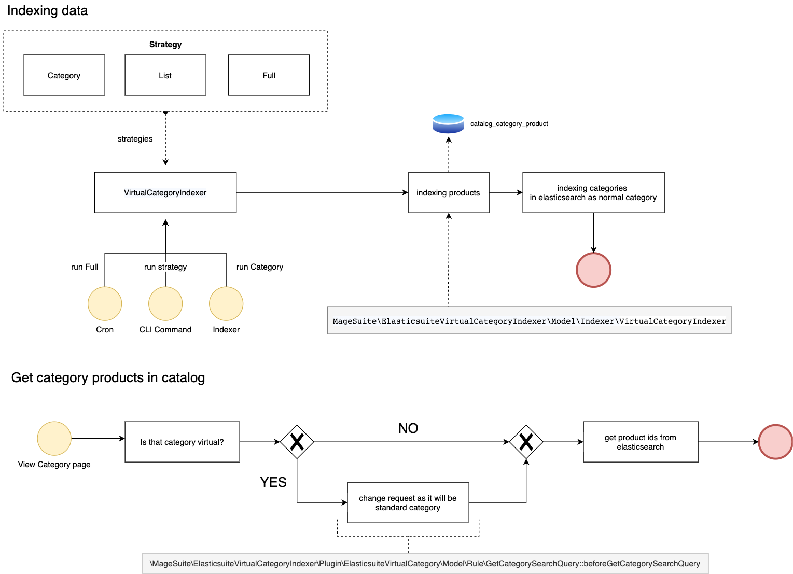

# ElasticSuite Virtual Category Indexer



## Configuration

To enable `virtual category indexer` or change a cron schedule go to:
- Admin area
- Store
- Conffiguration
- Magesuite
- Virtual Category Indexer
- General

## CLI Commmand

| Command                                                                                                  | Description                                                                      |
|----------------------------------------------------------------------------------------------------------|----------------------------------------------------------------------------------|
| `indexer:reindex elasticsuite_virtual_category_indexer`                                        | Reindex all virtual categories. It reindex whole  `catalogsearch_category` index |
| `indexer:reindex:virtual-category [-s, --strategy  [STRATEGY]] [-c , --ids [CATEGORY IDS]]` | Reindex virtual categories with strategy (full, list, category)                    |

## Cron

Full reindexation is runing automaticaly by cron schedule.

## Important module classes

| Class                                                                                                             | Responsibility                                                                                                                                                                                                    |
|-------------------------------------------------------------------------------------------------------------------|-------------------------------------------------------------------------------------------------------------------------------------------------------------------------------------------------------------------|
| MageSuite\ElasticsuiteVirtualCategoryIndexer\Model\Indexer\VirtualCategoryIndexer                                 | Insert product ids into the table `catalog_category_product` and refresh catalog and elasticsuite indexes                                                                                                         |
| MageSuite\ElasticsuiteVirtualCategoryIndexer\Model\ElasticsuiteVirtualCategory\Model\Preview                      | Allow to get raw data from from response from elasticsearch using `getRawData()` method                                                                                                                           |
| MageSuite\ElasticsuiteVirtualCategoryIndexer\Model\Catalog\ResourceModel\CategoryProduct                          | Extension Class for `Magento\Catalog\Model\ResourceModel\CategoryProduct`. Allow to insert _product_ ids for a virtual category into the table `catalog_category_product` and get theirs ids for other operations |
| MageSuite\ElasticsuiteVirtualCategoryIndexer\Model\Catalog\ResourceModel\Category\Collection                      | Extension Class for `Magento\Catalog\Model\ResourceModel\Category\Collection` provide the method `getVirtualCategoryIds()` to get all virtual category ids.                                                       |
| MageSuite\ElasticsuiteVirtualCategoryIndexer\Plugin\Catalog\Category\ReindexOnChange                              | Plugin which is call before runing the reindex method on category model and causes run `virtual category indexer`                                                                                                 |
| MageSuite\ElasticsuiteVirtualCategoryIndexer\Plugin\ElasticsuiteVirtualCategory\Model\Rule\GetCategorySearchQuery | Plugin which change value of `is_virtual_category` attribute to `null` . It force sendingstandard category request to elasticsearch instead of depends of the attribute value.                                    |
| MageSuite\ElasticsuiteVirtualCategoryIndexer\Service\VirtualCategoryIndexer                                       | Service which provide strategy logic for CLI Command                                                                                                                                                              |


## Extension attribute

Module provide the extension attribute `virtual_query` to modify request to elasticsaerch using the plugin.
If it has `true` smile works standardly. `False` value remove virtual query request.

See: `\Smile\ElasticsuiteVirtualCategory\Model\Rule::getCategorySearchQuery`

```php
public function getCategorySearchQuery($category, $excludedCategories = []): ?QueryInterface
{
    $query = null;

    if (!is_object($category)) {
        $category = $this->categoryFactory->create()->setStoreId($this->getStoreId())->load($category);
    }

    if (!in_array($category->getId(), $excludedCategories)) {
        $excludedCategories[] = $category->getId();

        if ((bool) $category->getIsVirtualCategory() && $category->getIsActive()) {
           $query = $this->getVirtualCategoryQuery($category, $excludedCategories, $category->getData('virtual_category_root'));
        } elseif ($category->getId() && $category->getIsActive()) {
            $query = $this->getStandardCategoryQuery($category, $excludedCategories);
        }
        if ($query && $category->hasChildren()) {
            $query = $this->addChildrenQueries($query, $category, $excludedCategories);
        }
    }

    return $query;
}
```


## EAV attribute

Module install a new category attribute `virtual_category_reindex_required`. If this attribute has `value=1` smile works standardly.

## Troubleshooting and todo in the future

### When change root category of virtual category, previous products still are in the category
To remove product from categories run full reindexation. 
